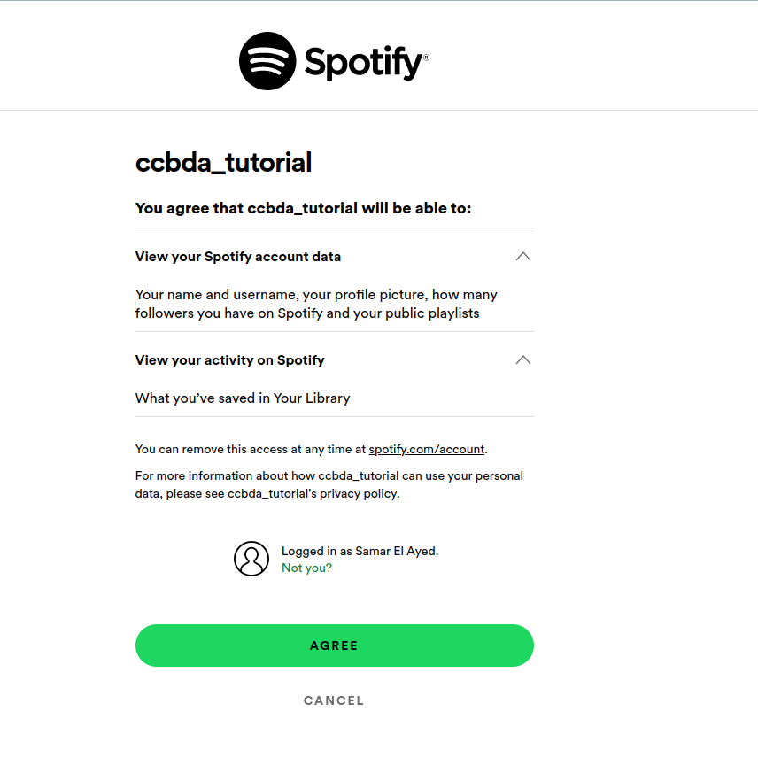
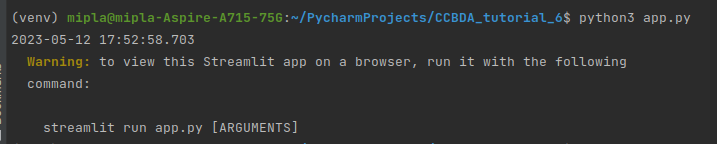
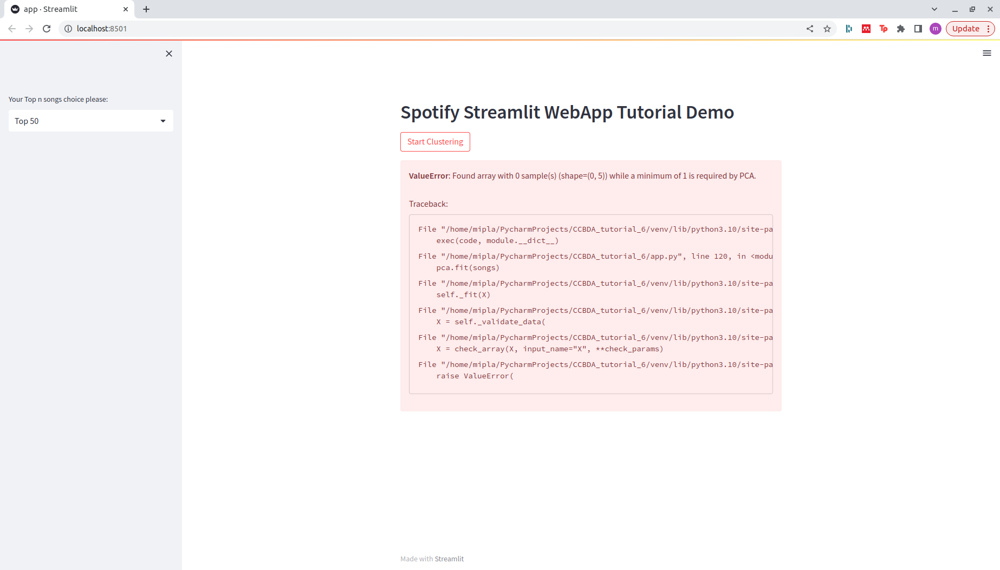
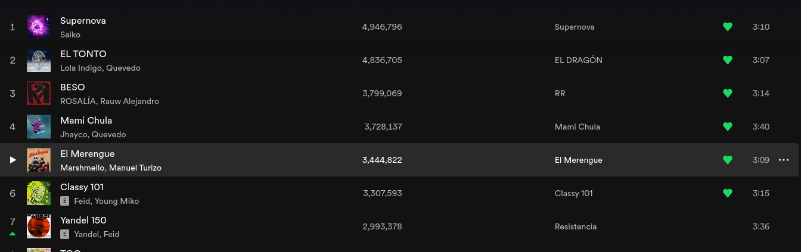
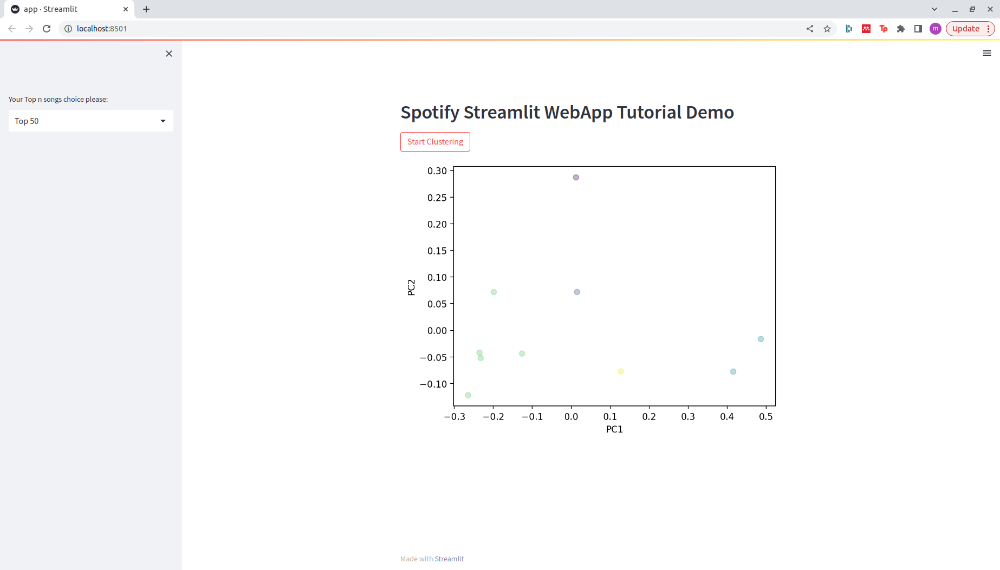

# Tutorial 6: Build a Spotify-integrated App

This tutorial consistes on discovering the spotify API by regestering in spotify as a developer, creating an application and finaly interacting with the Spotify services.

## Getting started

First of all we started by creating a new account and regestering as a develpper so we will be able to create application.

After listening to some Spanish music, we got back to work.

We visited to developer link and accepted the terms.

Now we created an app, everything so far went really smooth. The 
tutorial is clear and the spotify platform as well.

## Basic Demo WebApp
In order to test the webApp we have used the code given.
This code is a Streamlit web application that demonstrates clustering of Spotify songs based on their audio features.
The code creates an app which provides the user with a sidebar to select the range of top songs he wants to analyze and depending on the user's selection the top tracks are fetched and stored. If the clustering button is clicked, the selected songs are processed and the clustering algorithm is applied.
The resulting clusters are plotted in a scatter plot and finaly the scatter plot should be displayed in the Streamlit web app.

First, to run this code, we need to install the spotipy library.

We had some other uninstalled dependencies, so we installed those as well.

Sklearn didn't work, we needed to install scikit-learn instead.

## Spotify API exploration
In this step we want to connect to the Spotify API with Python using the spotpi library in order to retrieve information about a specific playlist from the Spotify API and then obtains details about the songs contained in that playlist as the name of the song, URI, popularity and some details about the main artists. 

This is looking better:

The redirect URL didn't work, so we changed that in the code:

This looks better, this now results in another URL.
We needed to paste this in terminal, apparently.

This was actually not the solution! The problem was we need to run "streamlit run app.py"
instead of "python app.py":

This solved this issue, but now the next problem was the following:

We looked into the code and saw that it clustered our liked songs. As we made a new
account for this tutorial, we didn't have any. So we liked some songs ons spotify.

Awesome! No we can see the clustering at work!

## General opinion

This was a fascinating tutorial. First of all we learned that there is a free spotify developer API. Amazing! We use spotify every
day, and it is something we do in our free time. Now we can analyze our own listening habits. We encountered some
problems trying to get everything running, but that is probably on us. The tutorial was perfect and well documented
with enough images and screenshots.

If we were to grade this tutorial we would give a 10/10, definitely!