# Tutorial 6: Build a Spotify-integrated App

## Getting started

First we needed to create a spotify account. For the sake fo the excercise we created a new
one with our UPC email.

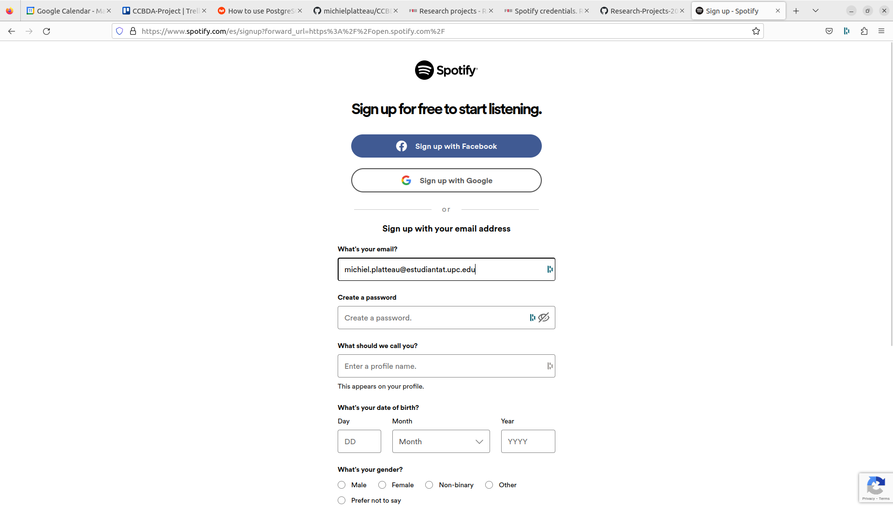

After listening to some Spanish music, we got back to work.

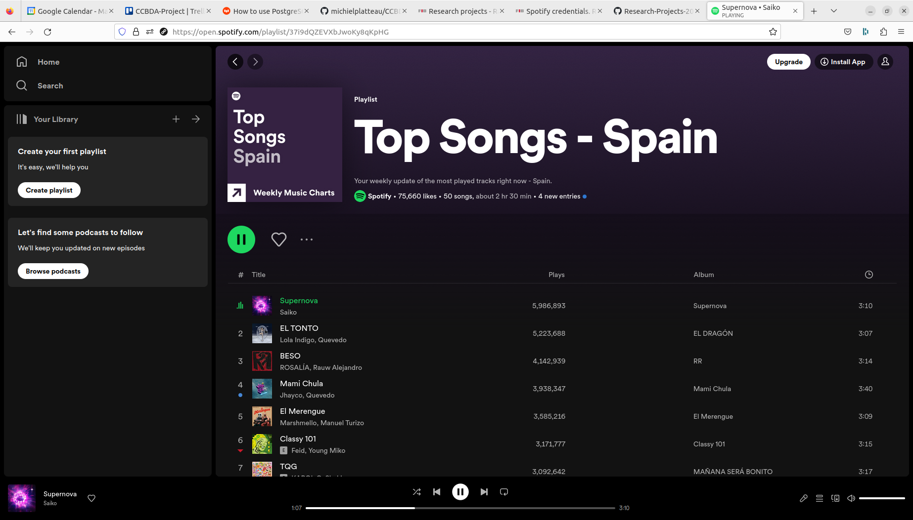

We visited to developer link and accepted the terms.

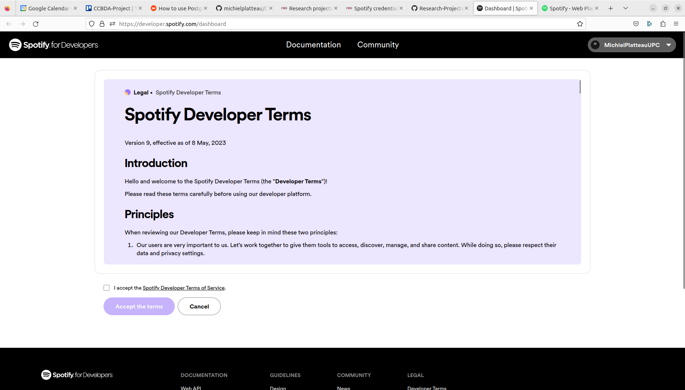
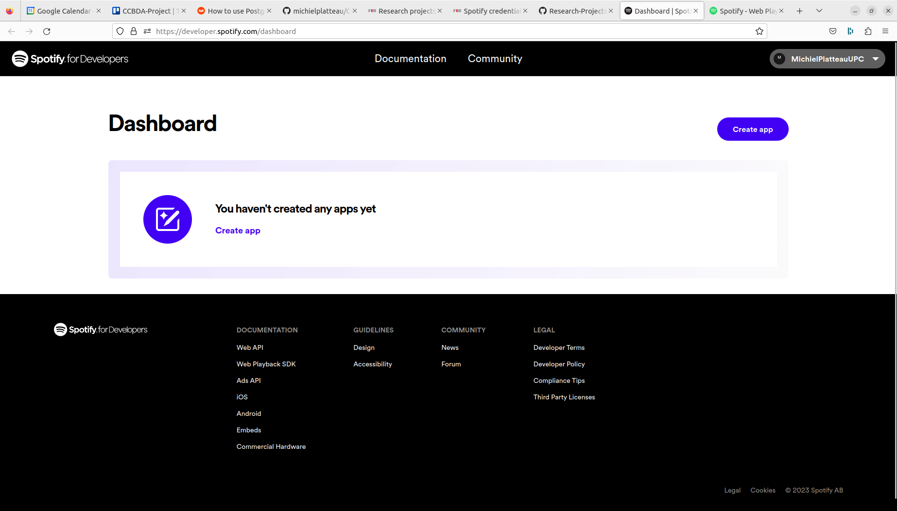

Now we created an app, everything so far went really smooth. The 
tutorial is clear and the spotify platform as well.

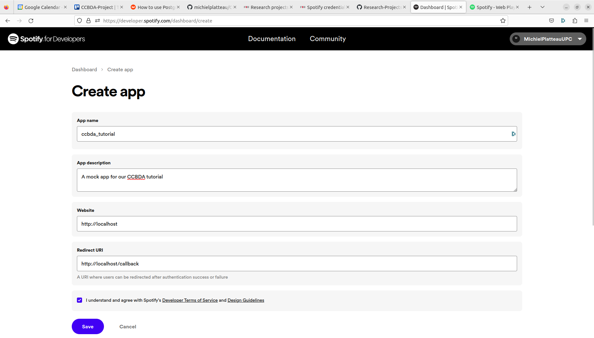
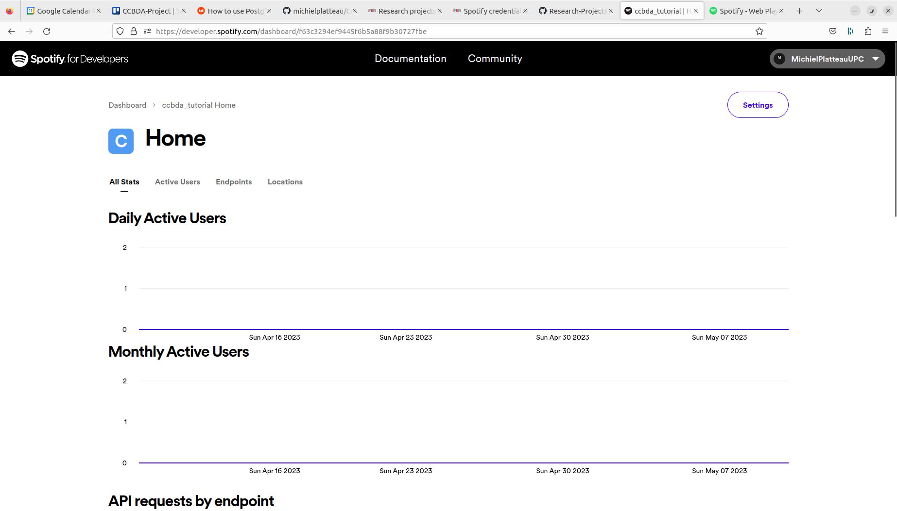

## Basic Demo WebApp

The tutorial supplied us with some streamlit code, so we copied it into our repo.

We need to install the spotipy library first.

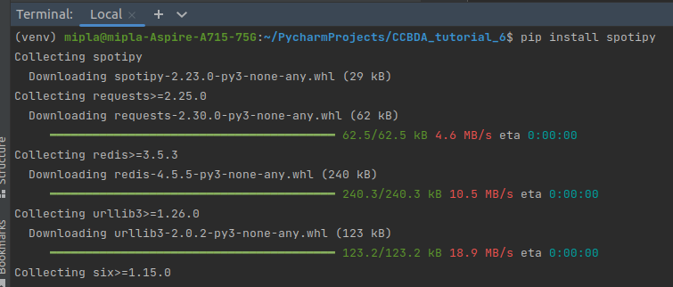

We had some other uninstalled dependencies, so we installed those as well.

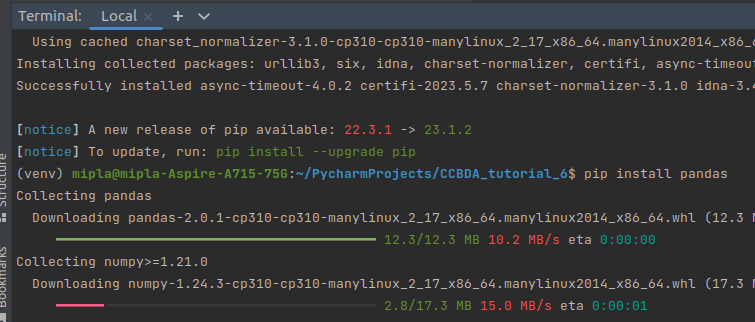
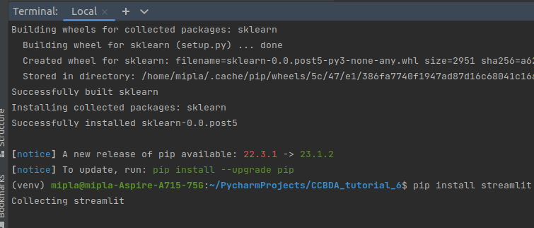

Sklearn didn't work, we needed to install scikit-learn instead.

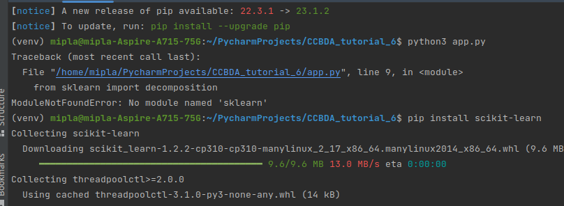

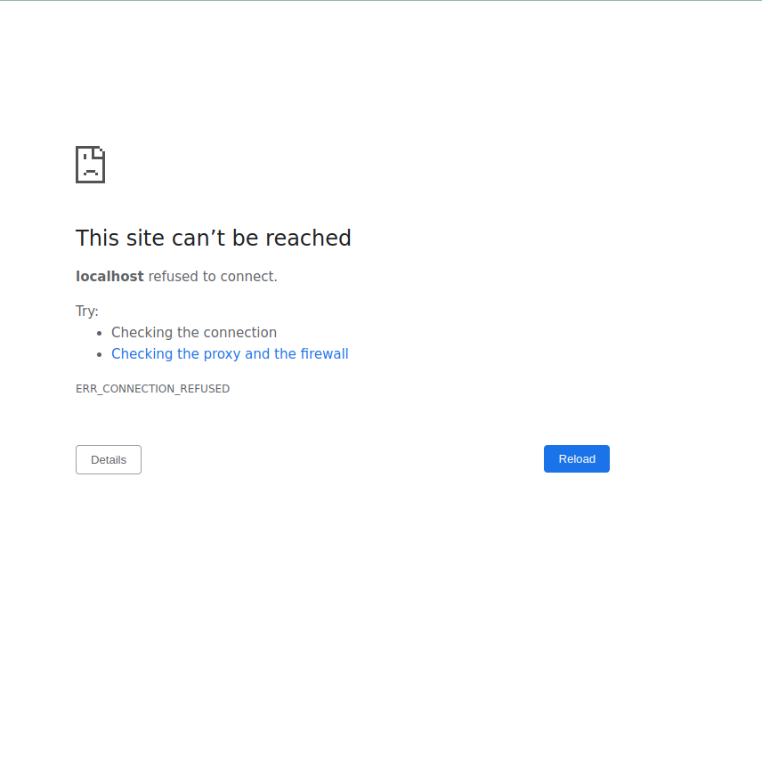
We needed to change the credentials with the ones from the raco maybe.

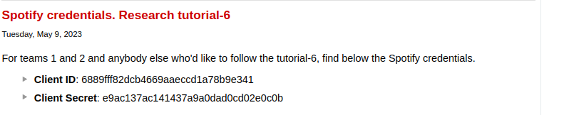
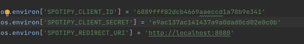

This is looking better:

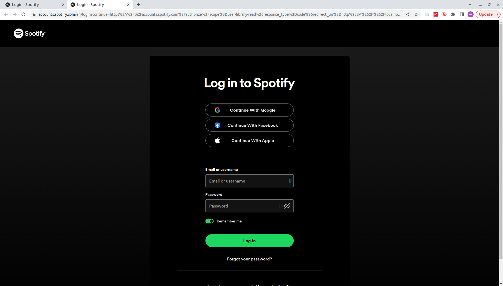

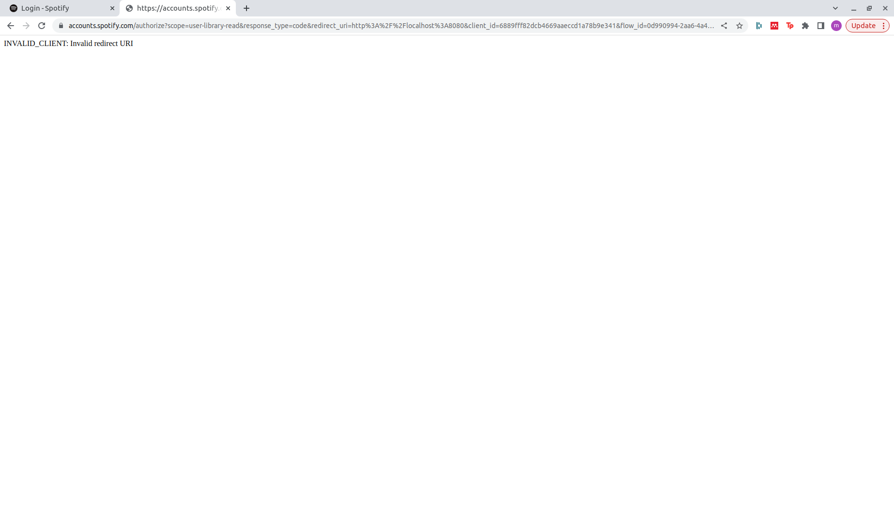

The redirect URL didn't work, so we changed that in the code:

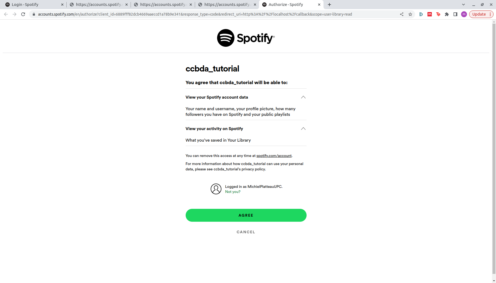

This looks better, this now results in another URL.
We needed to paste this in terminal, apparently.

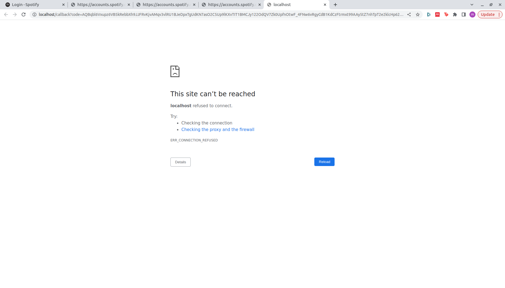
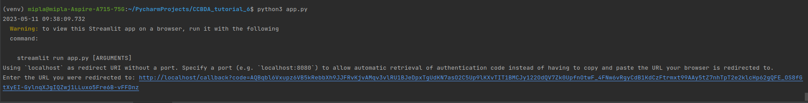

TODO it doesn't work for me.

## General opinion
